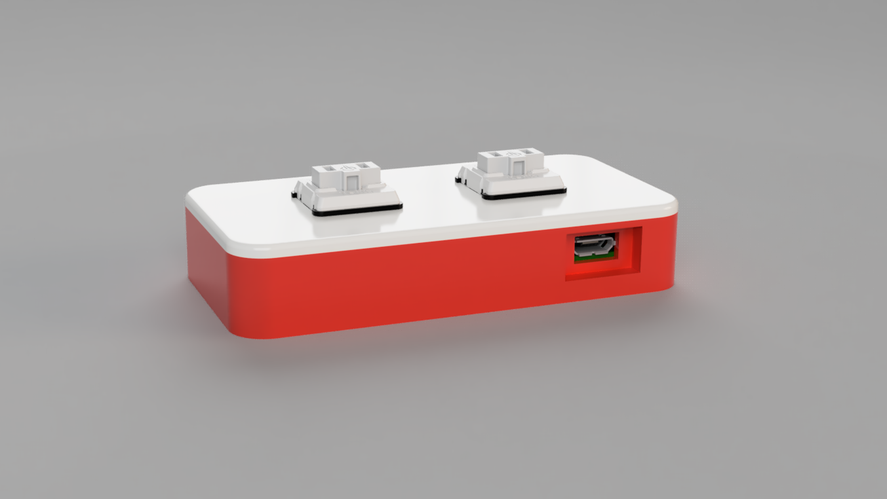
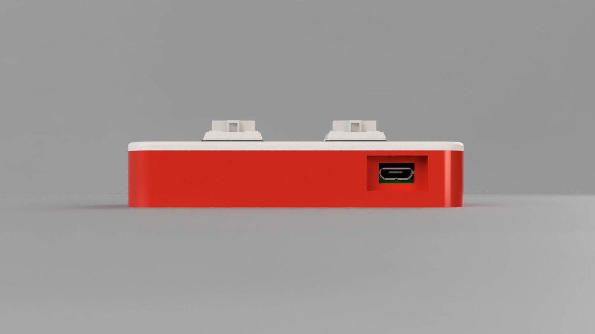

# **RASPBERRY PI ZERO W CASE (SLIM VERSION)** 🧰 

**Tags:**

---

## **PROJECT DESCRIPTION:**

Very **minimal and good looking** Raspberry Pi Zero W case with two holes for **two low profile mechanical switches**.

This container has been modeled and developed with the aim of generating a case that is **as minimal and comfortable as possible.**

The two pieces **fit together perfectly** and *no glue or special treatment* is needed to join the two 3D printed pieces.

  

### **Features**
- Possibility of inserting **two switches** on the cover of the case and assigning **each of them a command or a program hosted directly on the raspberry**.
- Case developed in *two different parts*, **without** the need for *any type of glue or treatment*. 
- *Precise hole* for inserting the **power cord**.

## **Ratings**

**Difficulty:** &nbsp;&nbsp;&nbsp;&nbsp;&nbsp;&nbsp;&nbsp;&nbsp;&nbsp;&nbsp;&nbsp;&nbsp;&nbsp; 1/5  ⭐⚫⚫⚫⚫

**Parts needed:** &nbsp;&nbsp;&nbsp;&nbsp;&nbsp;&nbsp; 1/5  ⭐⚫⚫⚫⚫

**Cost:** &nbsp;&nbsp;&nbsp;&nbsp;&nbsp;&nbsp;&nbsp;&nbsp;&nbsp;&nbsp;&nbsp;&nbsp;&nbsp;&nbsp;&nbsp;&nbsp;&nbsp;&nbsp;&nbsp;&nbsp; 1/5  ⭐⚫⚫⚫⚫

**Usefulness:** &nbsp;&nbsp;&nbsp;&nbsp;&nbsp;&nbsp;&nbsp;&nbsp;&nbsp;&nbsp; 2/5  ⭐⭐⚫⚫⚫

**Time needed:** &nbsp;&nbsp;&nbsp;&nbsp;&nbsp;&nbsp; 1/5  ⭐⚫⚫⚫⚫

---

## **3D MODELS IMAGES**

  

  
  

---

### **3D MODEL FILES:**

**All** 3D models files are **available for free** and *can be found in the repository.*

## **COMPONENTS**

**Hardware components:**
- 1 x Raspberry Pi Zero W / Raspberry Pi Zero 2 W
- 2 x Low profile Mechanical Key Switches *(Optional)*
- 1 x 3D Printed case

**Necessary tools:**
- 3D Printer 

### **How to assemble it**

1. Insert the *Raspberry Pi Zero W / Raspberry Pi Zero 2 W* in the case.
2. Insert the *two Mechanical Key Switches* into the slots on the housing cover *(Optional step)*
3. Wire the *two Mechanical Key Switches* to the **pins** of the *Raspberry*. *(Optional step)*
4. Close the 3D printed case.

---

## **GALLERY:**

### **RENDERS**

  

  

[//]: # (## **IRL Project Completed**)

